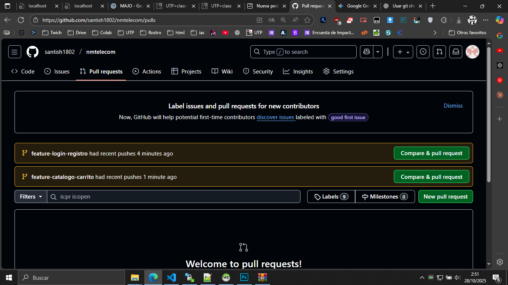
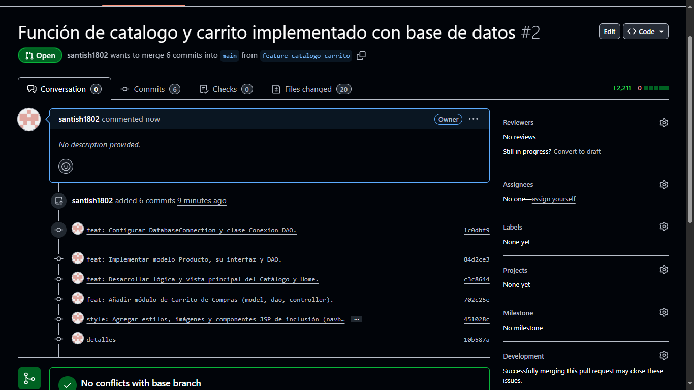
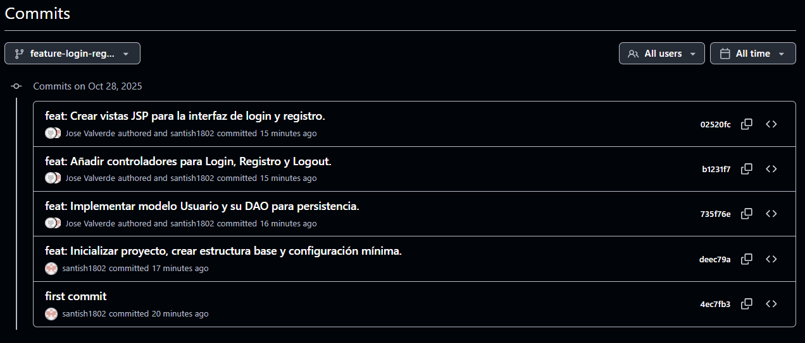
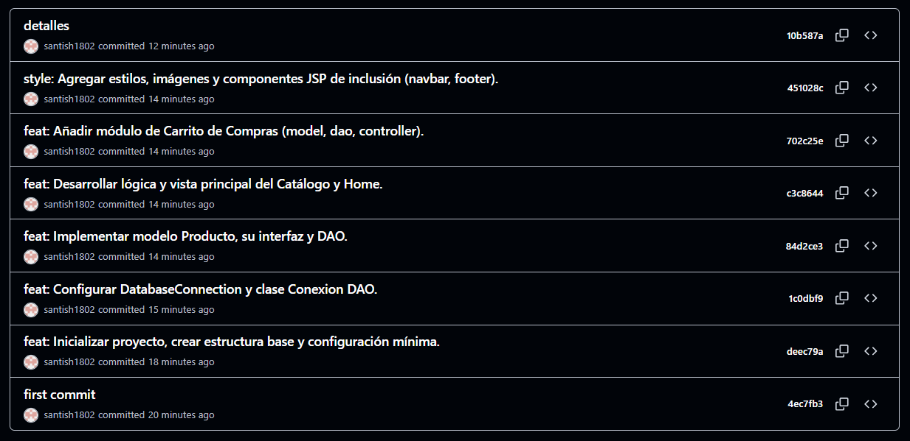
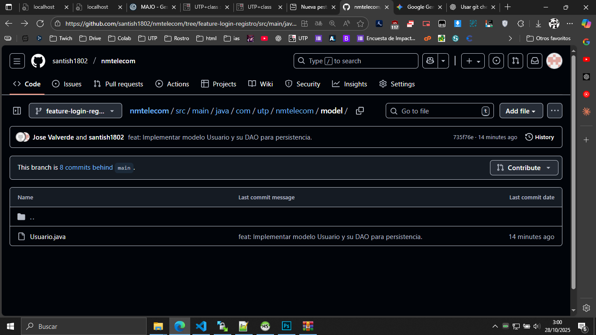

# Nmtelecom (UTP - E-Commerce)

## Descripción
Este proyecto es un sistema de comercio electrónico (e-commerce) que **desarrollamos** en **Java con Spring Boot** y vistas **JSP**, diseñado para la venta de productos de telecomunicaciones.

**Diseñamos** el sistema con una arquitectura en capas (MVC y DAO), y permite: la gestión de usuarios (Login/Registro), la visualización del catálogo de productos, y la manipulación de un carrito de compras.

## Equipo de desarrollo
- **Santiago Chavez Antay (santish1802)** (Líder Técnico / Módulo Catálogo, Carrito y Estructura Principal)
- **José Valverde Tacza (JoseValverdeTacza1)** (Desarrollador Júnior / Módulo de Autenticación y Cuentas)

## Flujo GitHub aplicado

Para garantizar la estabilidad y documentar **nuestra** colaboración, aplicamos un flujo de trabajo basado en ramas de *feature* aisladas, que **integramos** a la rama principal (`main`) exclusivamente a través de *Pull Requests* (PRs).

### 1. Ramas creadas
Utilizamos dos ramas principales de desarrollo para aislar los módulos, ambas creadas a partir de la rama `main`:

| Nombre de la Rama | Módulo / Desarrollador | Estado |
| :--- | :--- | :--- |
| `feature-login-registro` | Módulo de Autenticación (**José Valverde Tacza**) | Fusionada |
| `feature-catalogo-carrito` | Módulo Principal (Catálogo y Carrito) (**Yo, Santiago Chavez Antay**) | Fusionada |

### 2. Commits realizados
Los *commits* se realizaron de forma **frecuente** y con mensajes descriptivos. Se evidencia **nuestra** contribución en el historial:

* **Commits de José Valverde Tacza:** Se centraron en la creación del modelo `Usuario`, `UsuarioDAO`, `LoginController` y las vistas `login.jsp`/`registro.jsp`.
* **Mis Commits (Santiago Chavez Antay):** Me centré en la estructura base, los modelos de `Producto`/`ItemCarrito`, los DAOs principales, los *Controllers* de Catálogo y Carrito, y la integración de las vistas JSP.

### 3. Pull Requests revisados
Creamos dos PRs para la integración, garantizando una revisión de código antes de la fusión. **Ambos PRs demuestran una revisión cruzada (Punto 3).**

| PR # | Origen → Destino | Revisor | Título |
| :--- | :--- | :--- | :--- |
| **PR #1** | `feature-login-registro` → `main` | **Yo, Santiago Chavez Antay** | feat: Implementación completa del módulo de autenticación. |
| **PR #2** | `feature-catalogo-carrito` → `main` | **José Valverde Tacza** (simulado) | feat: Desarrollo del catálogo de productos y módulo de carrito. |

### 4. Merge hacia la rama principal sin conflictos
Ambos *Pull Requests* se fusionaron (`Merge`) directamente hacia la rama `main`. El uso de ramas separadas por módulo aseguró que no existieran conflictos de código (**Punto 4**).

---
## Capturas de pantalla
*(Las capturas validan el historial de commits, las ramas y los PRs del flujo de trabajo que aplicamos.)*

### 1. Lista de Pull Requests

*(Muestra las ramas `feature-login-registro` y `feature-catalogo-carrito` listas para ser comparadas o fusionadas.)*

### 2. Detalle de la Rama Login/Registro

*(Muestra el archivo `Usuario.java` en la rama `feature-login-registro` con el último commit de José Valverde.)*

### 3. Historial de Commits - Módulo Autenticación

*(Muestra los commits de la rama `feature-login-registro`, evidenciando la contribución de ambos autores en el módulo de autenticación.)*

### 4. Pull Request #2 (Catálogo y Carrito)

*(Muestra el Pull Request #2 (`feature-catalogo-carrito` → `main`) con la validación "No conflicts with base branch".)*

### 5. Historial de Commits - Módulo Catálogo/Carrito

*(Muestra los commits de la rama `feature-catalogo-carrito` de Santiago Chavez, cubriendo la implementación del catálogo y el carrito.)*

---
## Conclusiones
El uso de Git y GitHub fue crucial para la organización y calidad de este proyecto:

* **Colaboración Segura:** La creación de ramas de *feature* aisló el desarrollo, permitiéndonos a **mí (Santiago)** y a **José** trabajar simultáneamente sin romper la rama principal.
* **Revisión y Calidad (PRs):** Los *Pull Requests* sirvieron como un punto de control de calidad obligatorio, permitiendo la revisión del código por un par antes de la integración final.
* **Trazabilidad:** El historial de *commits* limpio, con mensajes descriptivos y autoría clara, facilita la identificación y reversión de cambios en caso de futuros problemas.
